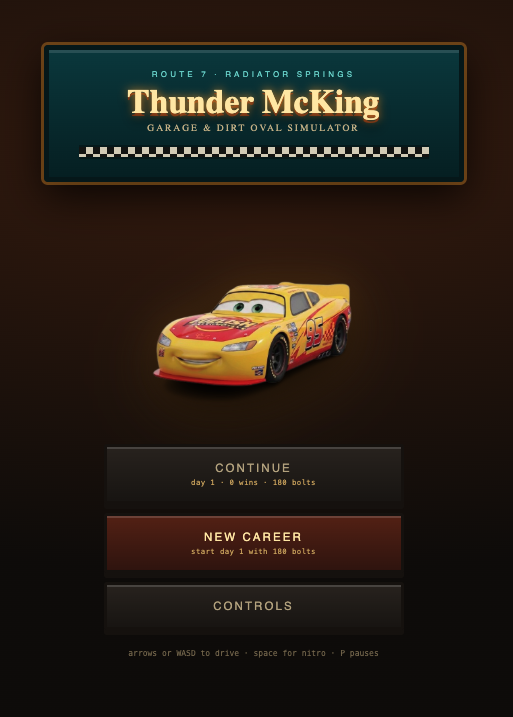
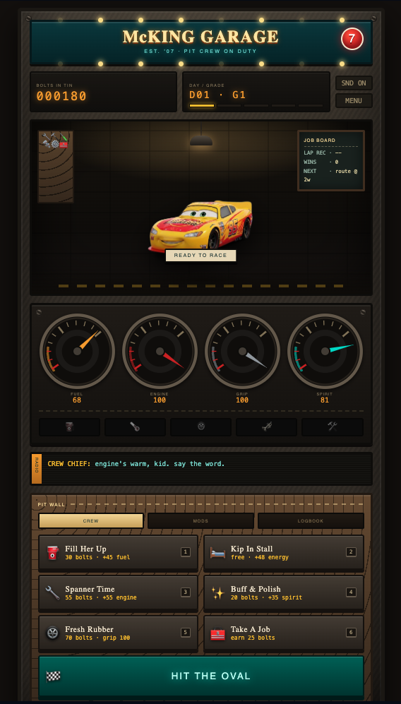
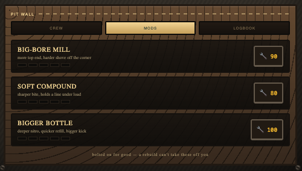
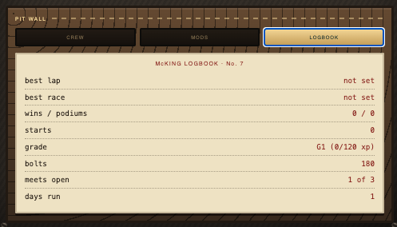

# Pet Racer 🏎️

A top-down browser racer built for Stardance. You pick a pet, jump on the track, manage your vehicle's health in real time, and hit the pit stop when your car starts falling apart.

---

### Notes for Stardance Reviewers

#### Originality
* Wanted to make a dynamic racer with an arcade feel instead of a standard text or puzzle game.
* Built a real-time pit management mechanic so you actually have to balance your speed against car wear and tear.
* Created custom touch controls so it works cleanly on mobile devices without needing a keyboard.
* Composed the main menu soundtrack myself.

#### Technical Details
* **Vanilla Stack:** Built entirely with plain HTML, CSS, and pure JavaScript inside `pet_racer.html` without heavy third-party libraries.
* **Vehicle State Loop:** Tracks speed, tire wear, and engine heat dynamically. Overusing nitro or taking sharp turns degrades your vehicle stats.
* **Dual Input System:** Listens for active input type and seamlessly toggles between keyboard bindings and on-screen touch thumb pads.
* **Mid-Race Pit Actions:** Mapped keys `1` through `6` to repair specific components on the fly without pausing the canvas loop.
* **Local Storage:** Saves garage unlocks and high scores directly to the browser.

#### Usability & Polish
* Plays instantly in Chrome, Safari, Edge, or Firefox.
* Mobile UI uses ergonomic thumb pad placement so your hands don't cover the main track view.
* Cleaned up the CSS layout to keep the frame rate steady on lower-end hardware.

#### Storytelling & Devlogs
* Documented the build process on YouTube, covering every bug fix and feature iteration. Check out the devlogs to see how the project came together.

---

### Controls

#### 💻 Desktop
* **Steer:** `A` / `D` or `←` `→`
* **Throttle:** `W` or `↑`
* **Brake / Reverse:** `S` or `↓`
* **Nitro:** `SPACE`
* **Pit Actions:** `1` – `6`
* **Pause:** `P` or `ESC`

#### 📱 Mobile
* **Steering:** Left on-screen thumb pad
* **Throttle / Brake:** Right on-screen thumb pad
* **Nitro & Pit Actions:** On-screen buttons

---

### Recent Updates
* **CSS Refactor:** Updated menu layouts and improved overall UI responsiveness on mobile screens.
* **Code Polish:** Cleaned up the main game loop and rewrote initial draft code to ensure the entire script is hand-crafted and lightweight.

---

### Known Issues
* None currently logged for this release.

---

### About
A browser-based pet racing game built with HTML, CSS, and Vanilla JavaScript.
